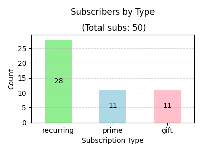
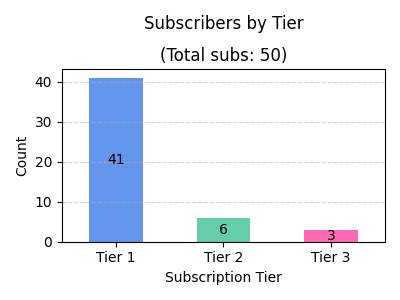
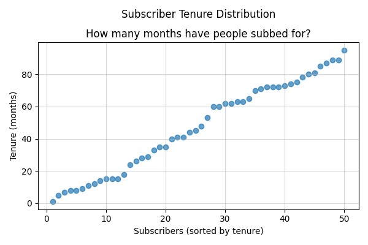

# twitch_subs Introduction

This project analyzes Twitch subscriber data to visualize trends and distributions of subscription types and tiers.

## Data Sources
- **Subscriber List:** subscriber-list.csv is generated on Twitch > Analytics > Earnings > Subscribers frame "View details" > "Download my subscriber list"
  https://dashboard.twitch.tv/u/YOUR_TWITCH_USERNAME/analytics/revenue-earnings/subscriptions
- another csv which can be fun to analyze is generated on Twitch > Creator Dashboard > Analytics > Overview > select desired time frame > Export Data
 https://dashboard.twitch.tv/u/YOUR_TWITCH_USERNAME/analytics

## Libraries Used
- pandas (for data manipulation)
- matplotlib.pyplot (for data visualization)
- You can find the list of available named colors for matplotlib charts [here](https://matplotlib.org/stable/gallery/color/named_colors.html).

## Example Output

## Changes:
**4/17**
- replaced line chart for subscriber tenure with scatter plot
- displaying key insights in a new df instead of a series of printed fstrings
- cleaned up charts, titles and labels
